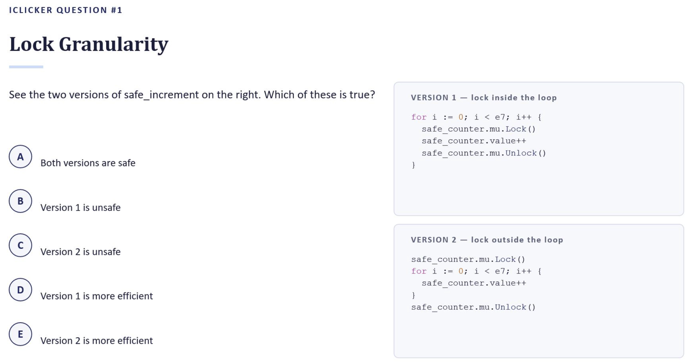
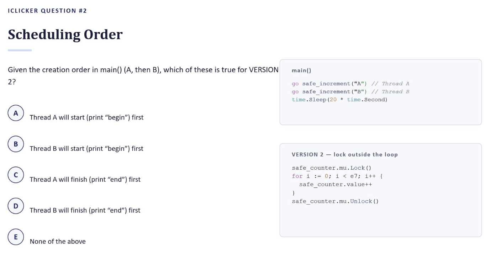
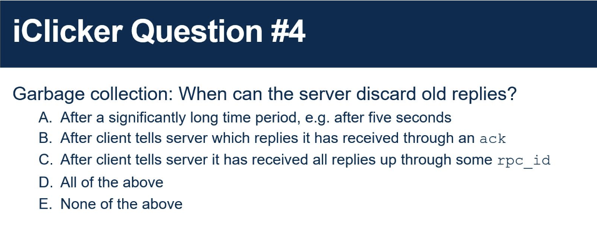

# CPSC 416 — iClicker Questions

## Question #1 — Lock Granularity



**Question:** See the two versions of `safe_increment` on the right. Which of these is true?

**Version 1 — lock inside the loop**

```go
for i := 0; i < e7; i++ {
    safe_counter.mu.Lock()
    safe_counter.value++
    safe_counter.mu.Unlock()
}
```

**Version 2 — lock outside the loop**

```go
safe_counter.mu.Lock()
for i := 0; i < e7; i++ {
    safe_counter.value++
}
safe_counter.mu.Unlock()
```

**Options**

- **A.** Both versions are safe
- **B.** Version 1 is unsafe
- **C.** Version 2 is unsafe
- **D.** Version 1 is more efficient
- **E.** Version 2 is more efficient

**Answer: A and E**

- **A — both versions are safe.** In each, every mutation of `safe_counter.value` happens while the lock is held, so no two goroutines ever touch it concurrently. The final count is exactly `2e7` either way.
- **E — Version 2 is more efficient.** It acquires and releases the lock once, instead of 10 million times. Each `Lock`/`Unlock` pair costs an atomic operation, and under contention the losing goroutine parks and reschedules — so V1 pays that overhead on every iteration.

**Notes:**

- Safety and efficiency are separate axes here. B and C are wrong because both versions are correctly synchronized; D is wrong because V1 has strictly more lock overhead.
- The catch with V2: holding the lock for the entire loop fully serializes the goroutines — B cannot start until A finishes. It is faster in this microbenchmark precisely *because* it gives up all concurrency. In real code, a coarse lock held across a long critical section is usually the wrong call, especially if it spans I/O or an RPC.
- The general rule: hold a lock for as short a section as correctness allows, but don't reacquire it in a tight loop when one acquisition covers the whole operation.

---

## Question #2 — Scheduling Order



**Question:** Given the creation order in `main()` (A, then B), which of these is true for **Version 2**?

```go
main()

go safe_increment("A")  // Thread A
go safe_increment("B")  // Thread B
time.Sleep(20 * time.Second)
```

**Version 2 — lock outside the loop**

```go
safe_counter.mu.Lock()
for i := 0; i < e7; i++ {
    safe_counter.value++
}
safe_counter.mu.Unlock()
```

**Options**

- **A.** Thread A will start (print "begin") first
- **B.** Thread B will start (print "begin") first
- **C.** Thread A will finish (print "end") first
- **D.** Thread B will finish (print "end") first
- **E.** None of the above

**Answer: E — none of the above**

When you launch a goroutine, you don't know exactly when it will start, and you don't know which one will run first. `go f()` only marks the goroutine as runnable; the Go scheduler decides when it actually gets a thread. Creation order in `main()` is not a promise about execution order.

**Notes:**

- **Why not A or B:** `fmt.Println(arg, ": begin")` happens *before* `mu.Lock()`, so the lock does nothing to order the two "begin" prints. They race, and either can win.
- **Why not C or D:** whichever goroutine acquires the lock first runs all `1e7` iterations while holding it and finishes first — but which one wins the lock is exactly the nondeterministic part. Go's `sync.Mutex` gives no FIFO or fairness guarantee on acquisition.
- **Seen in practice:** running the unsynchronized version of this program printed `B : begin` before `A : begin`, even though A was created first.
- **Takeaway:** if you need ordering between goroutines, you must create it explicitly — a channel, a `sync.WaitGroup`, or a mutex around the part you care about. Never infer ordering from the order of `go` statements.

---

## Question #3 — RPC Error Semantics


**Question:** RPCs provide different semantics from a local call because RPCs introduce a different class of errors.

**Options**

- **A.** True
- **B.** False

**Answer: A — True**

A local call either runs or the whole process dies with it — caller and callee share fate, memory, and address space. An RPC adds a network and a second machine, and with them a class of failures that has no local analogue: the request can be lost, the reply can be lost, the server can crash mid-execution, the network can partition, or the call can simply time out with the client unable to tell *which* of these happened.

**Notes:**

- **The ambiguity is the real problem.** On a timeout, the client cannot distinguish "the server never got it" from "the server ran it and the reply was lost." Local calls never leave you in that state.
- **This is why RPC frameworks expose delivery semantics at all:**
  - *At-least-once* — the client retries until it gets a reply, so the server may execute the same request multiple times. Fine for idempotent operations (`read(x)`), wrong for `withdraw(100)`.
  - *At-most-once* — the client tags each RPC with a unique ID and the server dedups, so a request executes zero or one times. On an exception you know it ran zero or one times, but not which.
  - *Exactly-once* is what you actually want and what a local call gives you for free; over an unreliable network it is not achievable in general.
- **Other leaks in the abstraction:** RPC arguments are marshalled and copied, so there are no pointers or shared mutable state across the call; latency is orders of magnitude higher; and client and server must agree on an interface, type widths, and byte order.
- **Takeaway:** stubs make an RPC *look* like a local call, but the abstraction is deliberately leaky. Code that treats a remote call as if it were local — no timeout handling, no retry policy, no idempotency story — is code that breaks the first time a packet drops.

---

## Question #4 — Garbage Collecting the Duplicate Table



**Question:** Garbage collection: when can the server discard old replies?

**Options**

- **A.** After a significantly long time period, e.g. after five seconds
- **B.** After the client tells the server which replies it has received through an `ack`
- **C.** After the client tells the server it has received all replies up through some `rpc_id`
- **D.** All of the above
- **E.** None of the above

**Answer: C — after the client tells the server it has received all replies up through some `rpc_id`**

At-most-once requires the server to keep a table of `rpc_id -> reply` so it can detect a duplicate and re-send the stored reply instead of re-executing. That table cannot grow forever. The rule for discarding an entry has to guarantee that the entry outlives every retry that could still reference it — and a cumulative "I have everything through #42" watermark is the mechanism that gives that guarantee cheaply. It is the TCP trick: the server drops the whole prefix in one shot, and the watermark piggybacks on the client's next request, so it costs no extra messages.

**Notes:**

- **Why not A — a timeout is a guess, not a guarantee.** Five seconds is an arbitrary number with no relationship to how long a retry can actually take. A retransmission that arrives at 5.1s hits an empty table, the server treats it as a fresh request and re-executes it, and you have silently fallen back to at-least-once — on exactly the workload where you were paying for at-most-once. A time bound only works if the client contractually promises to stop retrying within it, which means it is really a protocol change, not a GC policy.
- **Why not B — per-reply acks are safe but strictly worse.** Acking individual replies does keep the server correct, but it costs an extra message per RPC and leaves a sparse table: the client may ack #7 while #5 is still outstanding, so the server must track a set of holes rather than a single number. A lost ack also strands that entry forever. C subsumes all of this — one integer instead of a set, self-healing because a later watermark covers any lost earlier one, and free because it rides on the next request.
- **The state this buys you:** per client, the server keeps one number (the highest contiguous `rpc_id` the client has confirmed) plus the entries above it. Everything at or below the watermark is provably unreachable — the client has the reply, so it will never retry those.
- **Degenerate case worth naming:** if the client is allowed only one outstanding RPC at a time, the arrival of request `n+1` is itself proof that reply `n` was received, so the server can discard everything `<= n` with no acks or watermarks at all. C is the generalization of this to a pipelined client.
- **Takeaway:** a table entry must outlive every retry that could still reference it. Wall-clock time does not establish that; an explicit statement from the client about what it has received does.
